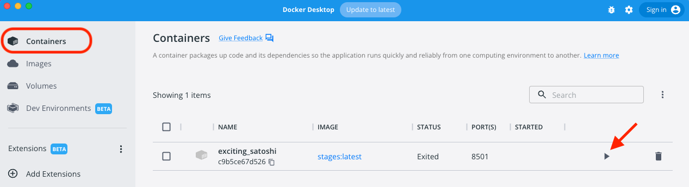
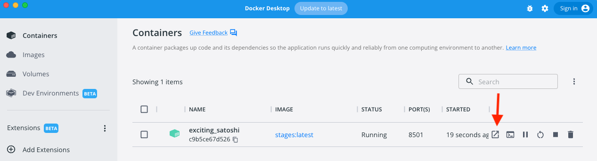

# Static and Temporal Analysis of Gene Expression Studies (STAGES) 
[](https://zenodo.org/badge/latestdoi/426521541)


STAGES (https://kuanrongchan-stages-stages-vpgh46.streamlitapp.com/) is an easy-to-use web tool that integrates data visualisation and pathway enrichment analysis for both static and temporal gene expression studies. STAGES is free and open to all users and there is no login requirement. The web tool works by running the Python programming language at backend to perform the data analysis and graph plotting, while the Streamlit framework is used to display the output data tables and graphs at frontend. Overall, STAGEs allow users to perform the following:

1. Conduct simple pre-processing and t-tests from count data or directly upload ratios and p-values
2. Correlation matrix comparing transcriptomics responses between different experimental conditions
3. Filter data to identify and quantify number of differentially expressed genes based on users’ pre-defined fold change and p-value cut-offs
4. Plot clustergrams based on DEGs, genes from Enrichr pathway enrichment analysis or leading edge genes from GSEA
5. Pathway analysis by Enrichr against Gene Ontology (GO) Biological Processes, GO Molecular Function. GO Cellular Component, Reactome and Humancyc databases. Also allows pathway enrichment analysis against customised gene sets such as the Blood Transcriptomic Modules (BTM) and our in-house curated database (Vaccinomics)
6. GSEA pre-ranked analysis against the Reactome database, BTM and Vaccinomics
7. STRING query based on DEGs or user-input gene list
8. Generate a PDF report of the analyses run on STAGES

<br>
<br>

# Getting started
## File Upload
Users may choose to either use a demo dataset (given in ratios and p-values), or one of 3 file options:

1. RNASeq raw counts

    a. Ideally duplicate genes should be removed

    b. FPKM and other normalised values should also be removed

    c. Row names should be HGNC gene symbols and columns should be subject ids
        
    | GeneSymbol | SubjectA_time0 | SubjectA_time1 | SubjectB_time0 | SubjectB_time1 |
    | --- | --- | --- | --- | --- |
    | CXCL10 | 530 | 421 | 234 | 56 |

    d. Following this, an additional file uploader is prompted for the user to select metadata for comparison in the downstream analyses. This should be presented in the form of subject IDs matching the count data in the rows and other grouping parameters in the columns
        
    | SubjectID | Timepoint | Gender |
    | --- | --- | --- |
    | SubjectA_time0 | time0 | F |
    | SubjectA_time1 | time1 | F |
    | SubjectB_time0 | time0 | M |
    | SubjectB_time1 | time1 | M |

2. Log2-normalised data

    a. If you’d prefer to do log2-transform your data beforehand and normalise the data elsewhere, select this option and upload your file

    b. Row names should be HGNC gene symbols and columns should be subject ids
        
    | GeneSymbol | SubjectA_time0 | SubjectA_time1 | SubjectB_time0 | SubjectB_time1 |
    | --- | --- | --- | --- | --- |
    | CXCL10 | 34 | 32.2 | 10.3 | 7.2 |

    c. Likewise, an additional file uploader is prompted for the user to select metadata for comparison in the downstream analyses. This should be presented in the form of subject IDs matching the count data in the rows and other grouping parameters in the columns
        
    | SubjectID | Timepoint | Gender |
    | --- | --- | --- |
    | SubjectA_time0 | time0 | F |
    | SubjectA_time1 | time1 | F |
    | SubjectB_time0 | time0 | M |
    | SubjectB_time1 | time1 | M |

3. Ratios and P-values

    a. If you have already conducted statistical tests elsewhere, upload your ratios and p-values here.

    b. Row names should be HGNC gene symbols and columns are ratios and pvalues for each comparison you’d like to make.

    c. For the comparisons to be detected, please name your columns as such, where the comparison can be of A vs B or time-based in the case below:

    | GeneSymbol | ratio_time1_vs_time0 | pval_time1_vs_time0 |
    | --- | --- | --- |
    | CXCL10 | 2.1 | 0.002 |

    d. Adjusted p-values may also be included if you choose not to use the multiple test correction here


## Pre-processing

1. RNASeq raw counts

    a. A violin plot will be displayed showing your counts (natural log +1 only for display purposes) before and after pre-processing

    b. Following this, a dropdown menu in the sidebar will show a slider for the violin plot to set your cutoff. This cutoff determines the genes that should be removed due to low counts. The threshold should ideally be set in the middle (the narrowest point) of a bimodal distribution shape

    c. Next, a dropdown menu will appear for users to select the grouping parameters from the metadata that they wish to use for comparison

    d. A multiple selection menu after this will be used for selection of the baseline comparison group (ie. if comparing day1 vs day0, select day 0 as the baseline)

    e. The next multiple selection menu will be used as the comparison groups to baseline (ie. if comparing day1 vs day0, day14 vs day0, select day1 and day14)

    f. A checkbox to assume equal (population) variance will appear. If we assume equal population variance, standard independent 2 sample test will be conducted. Otherwise, Welch’s t-test is performed.
    
    g. Next, a dropdown menu to choose your preferred multiple test correction method for p-values will appear

    h. If no multiple test correction was selected, do not select “Use corrected p-values for subsequent analyses”. Otherwise, users will have the options to either use the adjusted or unadjusted p-values

    i. Once everything has been selected, tick the selection complete checkbox to process your data

2. Log2-normalised counts

    a. A dropdown menu will appear for users to select the grouping parameters from the metadata that they wish to use for comparison

    b. A multiple selection menu after this will be used for selection of the baseline comparison group (ie. if comparing day1 vs day0, select day 0 as the baseline)

    c. The next multiple selection menu will be used as the comparison groups to baseline (ie. if comparing day1 vs day0, day14 vs day0, select day1 and day14)

    d. A checkbox to assume equal (population) variance will appear. If we assume equal population variance, standard independent 2 sample test will be conducted. Otherwise, Welch’s t-test is performed

    e. Next, a dropdown menu to choose your preferred multiple test correction method for p-values will appear

    f. If no multiple test correction was selected, do not select “Use corrected p-values for subsequent analyses”. Otherwise, users will have the options to either use the adjusted or unadjusted p-values

    g. Once everything has been selected, tick the selection complete checkbox to process your data

3. Ratios and p-values

    a. A dropdown menu to choose your preferred multiple test correction method for p-values will appear. If you already have adjusted pvalues and wish to use it, select None for the method and check the “Use corrected p-values for subsequent analyses” box.

## Correlation Matrix

a. From the sidebar menu, select one of 4 correlation methods:
- Pearson
- Spearman
- Kendall
- Phik

b. A correlation matrix showing the relationship between the log2 fold-change values of the comparisons will be plotted

## Differential Expression Analysis

This page features three plots and a data ouput tab:

1. DEG bar plot

    a. Users may select a p/adjusted-p value and fold-change cutoff with the number input options in the sidebar expander for ‘Differential expression bar plot options’
    
    b. Aesthetics such as the width and height of the stacked bar plot may also be changed in the sidebar expander
    
    c. These settings will be the basis for the DEGs in subsequent analyses

2. Volcano plot

    a. Users may change the log2 fold-change sliders where plot will show the genes within the range of the double-ended slider

    b. Users may also opt to change the -log10 p/adjusted-values where the plot will be updated with genes that are less than or equal to the plot boundaries

3. Cumulative Distribution plot

    a. Users may also view the trend in their gene expression data in a cumulative distribution curve, where genes are plotted from 0 < |FC| < 20

    b. The number of genes indicated are the total number of genes that meet the fold-change threshold (regardless of up or down regulation)

    c. The sidebar expander options for this plot include a p/adjusted p-value cutoff as well as a marker styling option

4. DEG Identity

    a. The user’s DEGs will then be displayed in the output tab and is available for download as an excel file

## Clustergram

Having completed the differential expression analysis in the previous page, there will be two options for users to input their data for the clustergram.

1. Select any number of DEG sets to include

    NOTE: If there are a lot of DEGs, the clustergram height will have to be adjusted to fully view the output

2. Manually input gene names

    a. these genes should be in HGNC symbols, separated by commas, newlines, or semicolons

    b. This option may be ideal for users who wish to see only the top up/down-regulated DEGs rather than the whole list

    c. Users who wish to do this may return to the differential expression analysis page under the data tab to copy gene names (Select + drag + CMD/CTRL + C). Clicking the header columns of these tabs will also sort the genes in ascending/descending order. Clicking into the dataframe and pressing CMD/CTRL + F will also bring up a search tab for users to find specific gene names

3. Options to customise the clustergram include:

    - Cluster columns checkbox
        - This may be useful for time series data where columns should be left in chronological order rather than reordered by clusters
    - Relative dendrogram length number input
        - This length refers to the dendrogram lines on the left of the heatmap. The input ranges from 0.01 to 1.00.
    - Relative dendrogram height number input
        - This height refers to the dendrogram lines on the top of the heatmap. The input ranges from 0.01 to 1.00.
        - This option will only apply if the user is clustering their columns.
    - Clustergram width and height number input
        - This option is in inches with a maximum width and height of 30 and 60 respectively.
    - Colourbar limit double-ended slider
        - This option will rescale the colours to fit the lower and upper colourbar limits. The centre of this colourbar will always be fixed at 0.
    - Colourbar position from the left and bottom number input
        - These options will reposition the colourbar such that users may prevent its overlap with the axes
        - The number input ranges from 0.0 to 1.0
    - Colourbar width and height options
        - The number input ranges from 0.0 to 1.0

NOTE: to prevent the input options from glitching and resetting to the last saved state, deselect the “Plot clustergram” checkbox and make the necessary changes before reselecting it.

## Enrichr

Enrichr is a tool developed by [Ma’ayan lab](https://maayanlab.cloud/Enrichr/) that enables users to input sets of genes and visualise the pathways that are enriched by these genes.

1. Options to customise the enrichr plots include:
    - Custom gene set uploader (optional)
        - Users may choose to upload their own GMT file whose format is as follows:
        
            |  |  |  |  |  |
            | --- | --- | --- | --- | --- |
            | Module_A | Describe_module_A | Gene 1 | Gene 2 |  |
            | Module_B | Describe_module_B | Gene 1  | Gene 2 | Gene 3 |
            |  |  |  |  |  |
        
        - NOTE: there should not be any header columns in the file

    - Geneset selection
        - Genesets that are currently available and commonly used will be available below
        - Any user-uploaded genesets will also be made available

    - DEG selection
        - Users may select any number of sets of DEGs to use in enrichr

    - Display top n pathways to plot
        - Further filtering of the pathway bar plots is available by selecting the top n pathways to plot after the pathways meet the adjusted p-value threshold of < 0.05

    - Bar plot height
        - Customise the height of the bar plots in pixels.
        - The range is from 200 to 1600 px

NOTE: Larger gene sets like Gene Ontology (GO) may take longer to run than other gene sets.

## GSEA Preranked Analysis

GSEA preranked analysis uses a user-selected ranking of genes to determine if there are significant biological differences between two conditions. More information on this method may be found [here](https://www.pnas.org/doi/full/10.1073/pnas.0506580102). 

1. Options to customise the GSEA preranked plots include:
    - Custom gene set uploader (optional)
        - Same as enrichr
        - Reupload of the same genesets is not required
    - Geneset selection
        - Genesets that are currently available and commonly used will be available below.
        - Any uploaded genesets will also be made available
    - Select dataframe to use
        - This is mostly applicable if multiple gene expression datasets are uploaded
    - Select comparison to use for prerank
        - The function will rank the selected log2 fold-change comparisons in descending order
    - Display top n pathways to plot
        - Further filtering of the pathway bar plots is available by selecting the top n pathways to plot after the pathways meet the adjusted p-value threshold designated by the user
    - Bar plot height
        - Customise the height of the bar plots in pixels
        - The range is from 200 to 1600 px

Current limitation: prerank of GO libraries may result in the server crashing as the server has memory limits of 1GB. One way to alleviate this issue would be to run this tool locally with Docker (explained at the end under [Local Usage](https://github.com/kuanrongchan/STAGES#local-usage)).

## STRING Query

Users may use their DEGs or input their own sets of genes into the textbox.

- The line thickness between the genes indicate the confidence between the interactions

Current limitation: The lack of customisation available and the species being limited to homo sapiens.

## Report

- Users may view the auto-generated report based on their selections and download it as a PDF file.

<br>
<br>

# Local Usage

- Due to memory constraints on the online webtool, users may choose to run this webtool locally on their own machine.

## Initial Set-up
1. Users will have to download 2 items:
    - [Docker](https://www.docker.com/) - choose a suitable installation for your machine
    - STAGES’s [github repository](https://github.com/kuanrongchan/STAGES.git) as a zip file
2. Set up the docker installer
3. Unzip the file
4. Open PowerShell/Terminal and copy the following code into it, adding your own file path to the github folder:
    ```bash
    cd path/to/githubrepo # changes the directory to where the github repo is
    docker build -t stages . # Builds the Docker image (necessary packages and environment). This only needs to be run for the first time on setup.
    docker run -p 8501:8501 stages # runs the Docker image
    ```
    If the build was successful, this should be displayed in the output. Copy the URL into your browser and run the app. If the URL does not run, try http://localhost:8501.

    ```bash
    You can now view your Streamlit app in your browser.

    URL: http://0.0.0.0:8501 # Copy this and paste it into your browser
    ```

## Subsequent Usage
### Running Docker container interactively within the desktop app

1. Run the container


2. Open the webtool in your brower


### Running Docker container within the command line

```bash
cd path/to/githubrepo # Replace this path with your own computer's path to the github repository
docker run -p 8501:8501 stages
```

# Data safety and security
The data you upload is safe and is never stored anywhere.

<br>

# Contributors
These apps are jointly made by myself (Kuan Rong Chan), Clara Koh, Justin Ooi and Gabrielle Lee from Duke-NUS, Department of Emerging Infectious Diseases. I am also thankful for Eugenia Ong and Ayesa Syenina from VIREMICS for their constructive feedback. For more details on what we do, feel free to visit us at [kuanrongchan.com](kuanrongchan.com).
